<!--## Is Overfitting Necessary for Implicit Video Representation?-->


<!-- authors -->
<!-- Author 1, Author 2, Author 3 (†: \dagger)-->
<h2><p style="text-align: center;">Hee Min Choi<sup>* †</sup> · Hyoa Kang<sup>*</sup> · Dokwan Oh</p></h2>

<br />
<br />

<!-- abstract -->
## __Abstract__
Compact representation of multimedia signals using implicit neural representations (INRs) has advanced significantly over the past few years, and recent works address their applications to video. Existing studies on video INR have focused on network architecture design as all video information is contained within network parameters. Here, we propose a new paradigm in efficient INR for videos based on the idea of strong lottery ticket (SLT) hypothesis, which demonstrates the possibility of finding an accurate subnetwork mask, called supermask, for a randomly initialized classification network without weight training. Specifically, we train multiple supermasks with a hierarchical structure for a randomly initialized image-wise video representation model without weight updates. Different from a previous approach employing hierarchical supermasks, a trainable scale parameter for each mask is used instead of multiplying by the same fixed scale for all levels. 
This simple modification widens the parameter search space to sufficiently explore various sparsity patterns, leading the proposed algorithm to find stronger subnetworks. Moreover, extensive experiments on popular UVG benchmark show that random subnetworks obtained from our framework achieve higher reconstruction and visual quality than fully trained models with similar encoding sizes. Our study is the first to demonstrate the existence of SLTs in video INR models and propose an efficient method for finding them.
<br />
<br />

<!-- architecture -->
## __Architecture__
<figure>
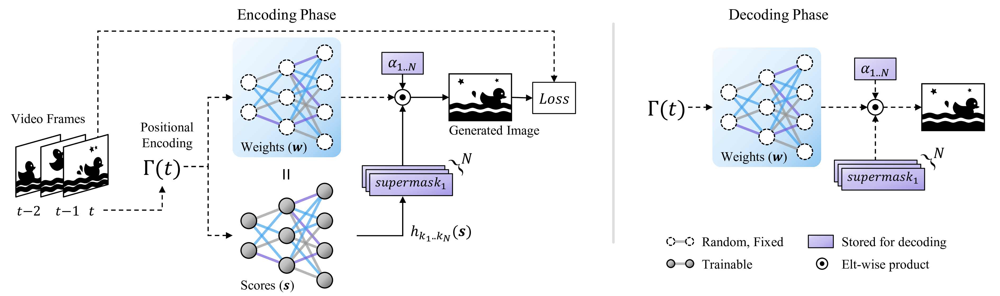
<figcaption>Overview of the proposed video representation framework.</figcaption>
</figure>
<!--using figure
<figure>

<figcaption>Overview of the proposed video representation framework. In the encoding phase, our video representation framework finds multiple supermasks and corresponding scale parameters in an implicit video representation network without training its weights. In the forward path, scores $$s$$ of the randomly initialized network weights $$w$$ are sorted, and $N$ masks are assigned to the weights using step functions $$h_{k_n}$$'s. The threshold scores of the step functions are determined by pre-defined densities $k_n$'s of nonzeros in the supermasks. The masks are then scaled by learnable parameters $\alpha_n$'s and accumulated to calculate the output of the network. In the backward path, the mean-squared error loss between the ground truth video frames and the network outputs is computed, and only the scores $$s$$ and scales $$\alpha_n$$'s are updated by back-propagation. As all network parameters are fixed and random, we can recover the encoded images by simple network inference using random seed used at train time, $$N$$ final supermasks and learned scale parameters $$\alpha_n$$'s in the decoding phase. This differs from the existing implicit video representation methods, which require storing model weights and biases.</figcaption>
</figure> -->
<br />
<br />

## __Decoded Images__
### Proposed (learned scales) vs. Trained Dense
<!-- 

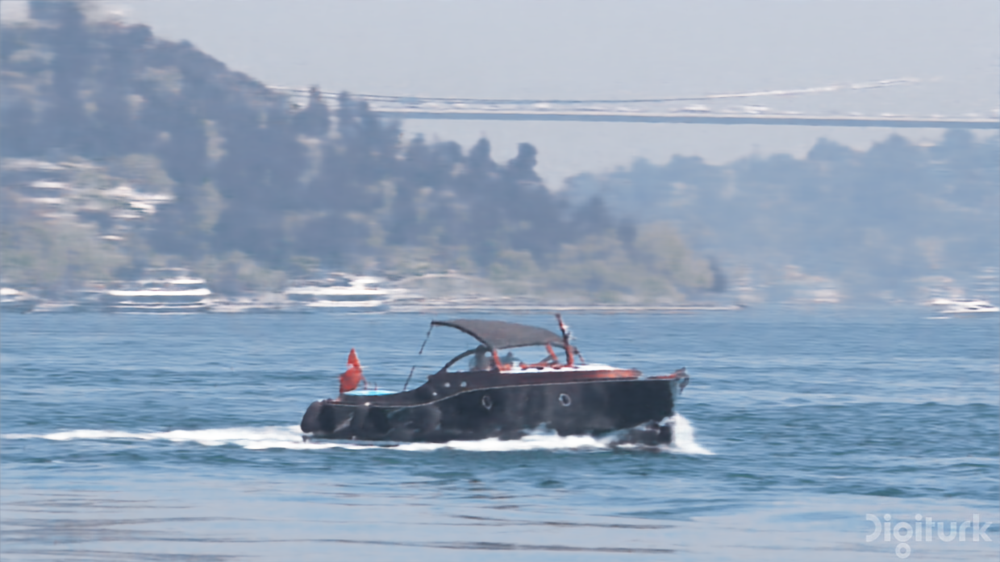


 -->
<!-- | Ground Truth                    | Proposed (learned scales), BPP=0.060  | Trained Dense, BPP=0.064                     |
|---------------------------------|---------------------------------------|----------------------------------------------|
|   |   |   |
|  |  |  | -->
<table>
    <tr>
        <td style="text-align: center">Ground Truth</td>
        <td style="text-align: center">Proposed (learned scales), BPP=0.060</td>
        <td style="text-align: center">Trained Dense, BPP=0.064</td>
    </tr>
    <tr>
        <td style="text-align: center"></td>
        <td style="text-align: center"></td>
        <td style="text-align: center"></td>
    </tr>
    <tr>
        <td style="text-align: center"></td>
        <td style="text-align: center"></td>
        <td style="text-align: center"></td>
    </tr>
</table>
<br />

### Proposed (learned scales) vs. Trained Sparse
<!-- 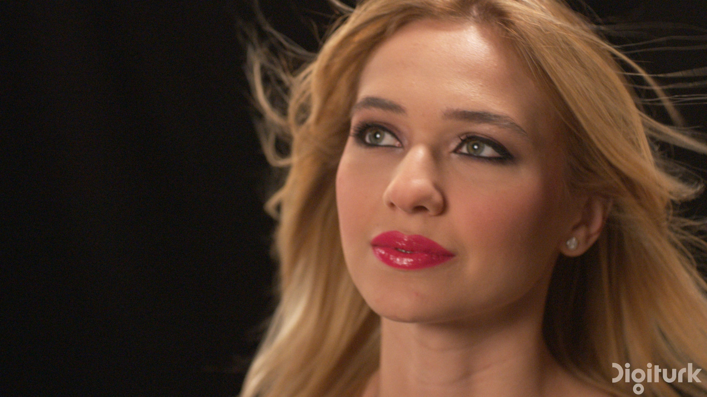

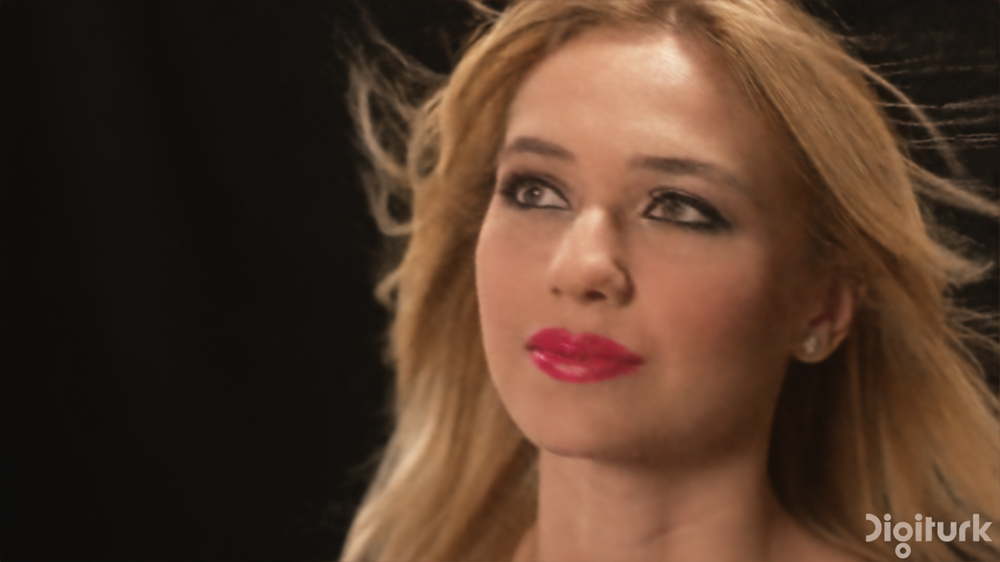
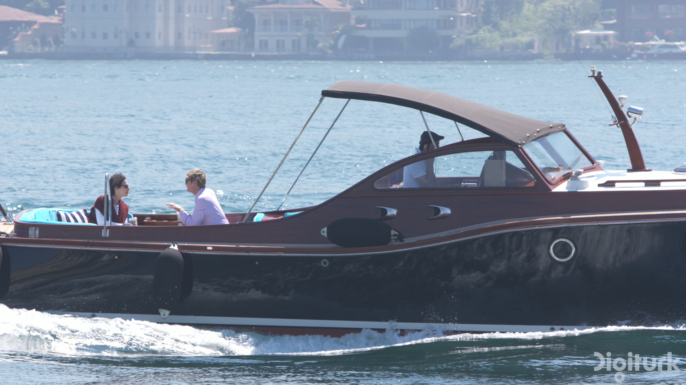
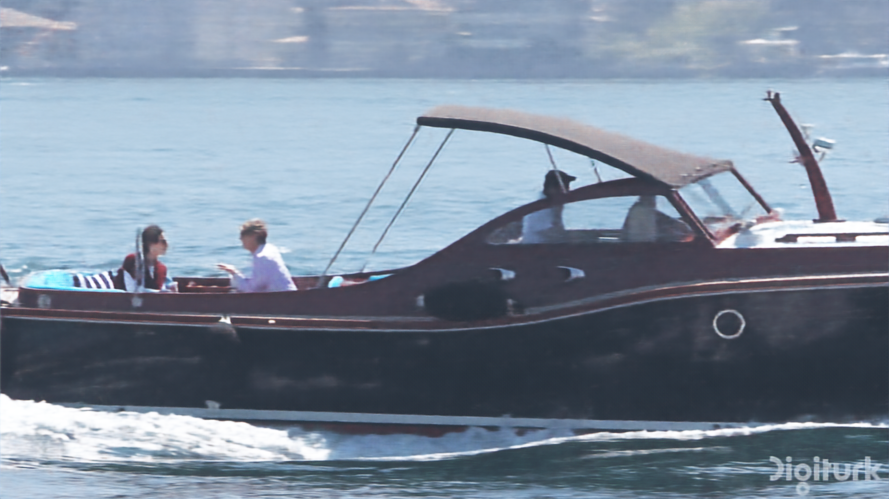
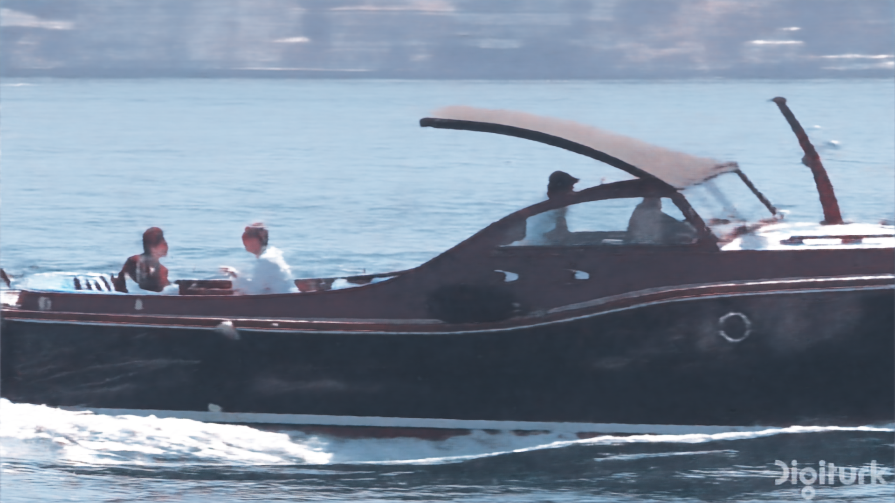 -->
<!-- | Ground Truth                   | Proposed (learned scales), BPP=0.060 | Trained Sparse, BPP=0.076                    |
|--------------------------------|--------------------------------------|----------------------------------------------|
|   |   |   |
|  |  |  | -->
<table>
    <tr>
        <td style="text-align: center">Ground Truth</td>
        <td style="text-align: center">Proposed (learned scales), BPP=0.060</td>
        <td style="text-align: center">Trained Sparse, BPP=0.076</td>
    </tr>
    <tr>
        <td style="text-align: center"></td>
        <td style="text-align: center"></td>
        <td style="text-align: center"></td>
    </tr>
    <tr>
        <td style="text-align: center"></td>
        <td style="text-align: center"></td>
        <td style="text-align: center"></td>
    </tr>
</table>
<br />

### Proposed (learned scales) vs. Proposed (fixed scales)
<!-- 
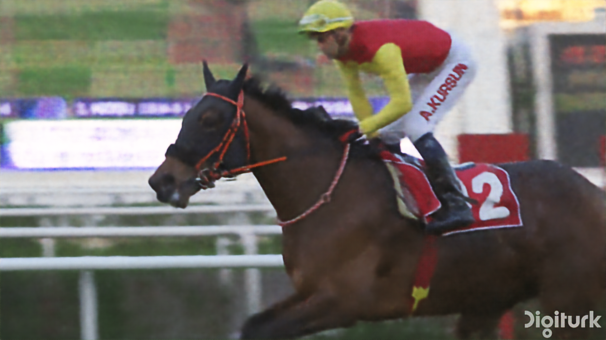
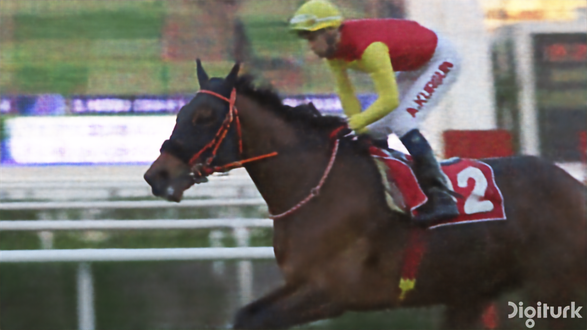
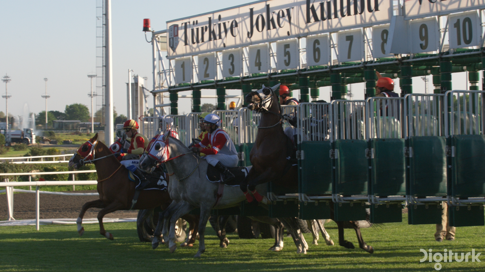
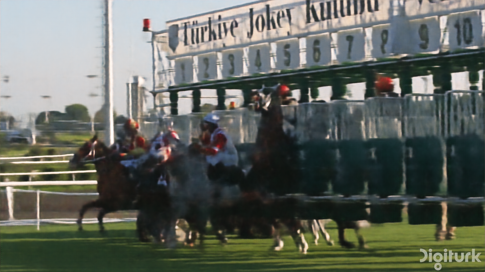
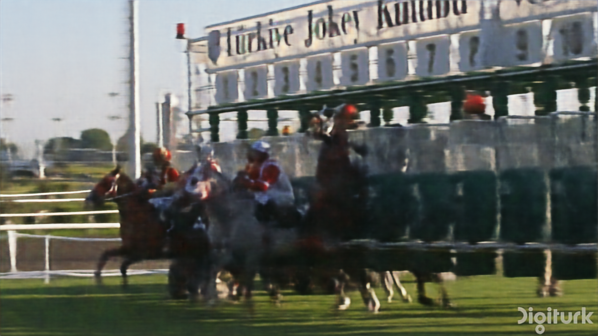 -->
<!-- | Ground Truth                         | Proposed (learned scales), BPP=0.060       | Proposed (fixed scales), BPP=0.060        |
|--------------------------------------|--------------------------------------------|-------------------------------------------|
|         |         |         |
|  |  |  | -->
<table>
    <tr>
        <td style="text-align: center">Ground Truth</td>
        <td style="text-align: center">Proposed (learned scales), BPP=0.060</td>
        <td style="text-align: center">Proposed (fixed scales), BPP=0.060</td>
    </tr>
    <tr>
        <td style="text-align: center"></td>
        <td style="text-align: center"></td>
        <td style="text-align: center"></td>
    </tr>
    <tr>
        <td style="text-align: center"></td>
        <td style="text-align: center"></td>
        <td style="text-align: center"></td>
    </tr>
</table>
<br />
<br />

## __FLIP Visualization__
We further provide [FLIP maps](https://dl.acm.org/doi/10.1145/3406183) for the decoded images. FLIP generates a map of approximating errors recognized by humans when alternating between two images. In FLIP maps, bright color corresponds to large error and dark to small error, and smaller FLIP value is better. We find that at low BPP settings (BPP < 0.1), the proposed method better encodes small objects in large area having repeated patterns compared with three baseline methods.

### Proposed (learned scales) vs. Trained Dense
#### Bosphorus
<!-- |                    | Proposed (learned scales), BPP=0.060   | Trained Dense, BPP=0.064 |
|:------------------:| :------------------------------------: | :--------------------------------: |
| FLIP               | 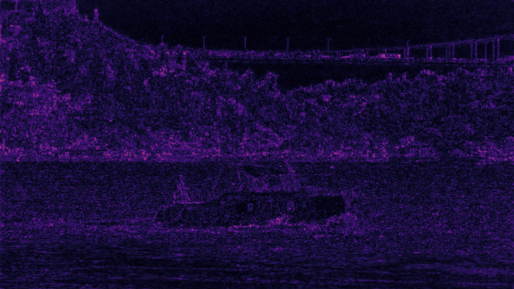 </br> FLIP=0.1258 | 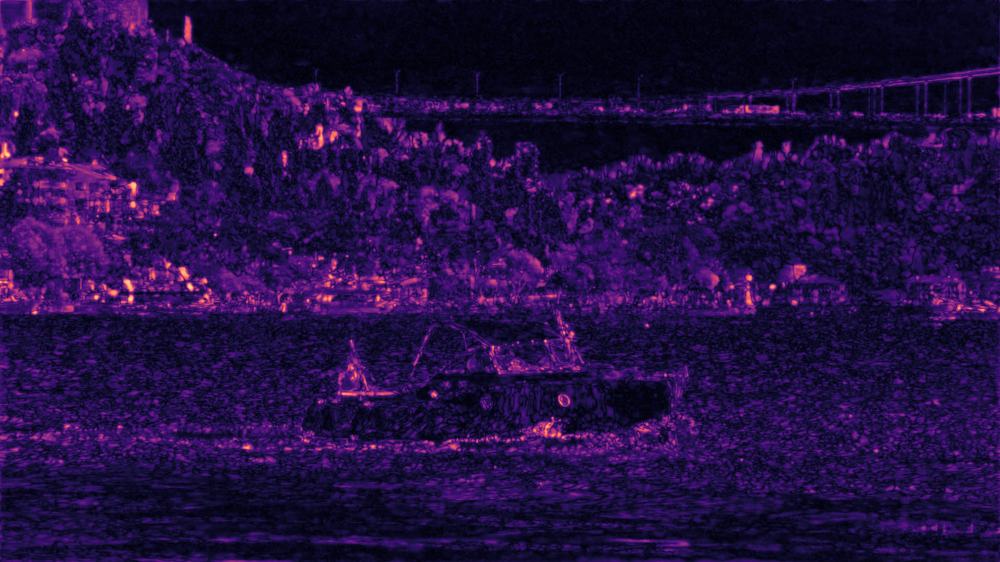 </br> FLIP=0.1613 |
| Decoded</br> Image |      |  | -->
<table>
    <tr>
        <td style="text-align: center"></td>
        <td style="text-align: center">Proposed (learned scales), BPP=0.060</td>
        <td style="text-align: center">Trained Dense, BPP=0.064</td>
    </tr>
    <tr>
        <td style="text-align: center">FLIP</td>
        <td style="text-align: center"><br />FLIP=0.1258</td>
        <td style="text-align: center"><br />FLIP=0.1613</td>
    </tr>
    <tr>
        <td style="text-align: center">Decoded<br />Image</td>
        <td style="text-align: center"></td>
        <td style="text-align: center"></td>
    </tr>
</table>
<br />

#### HoneyBee
<!-- |                    | Proposed (learned scales), BPP=0.060   | Trained Dense, BPP=0.064 |
|:------------------:| :------------------------------------: | :--------------------------------: |
| FLIP               | 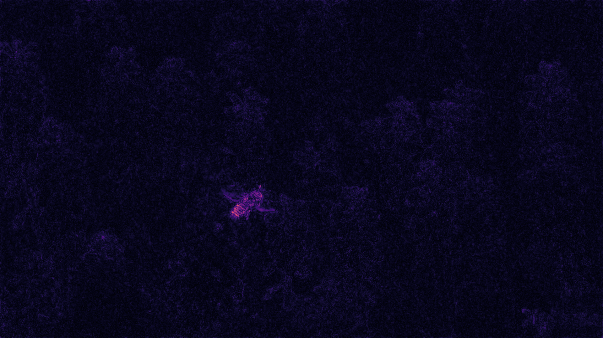 </br> FLIP=0.0532 | 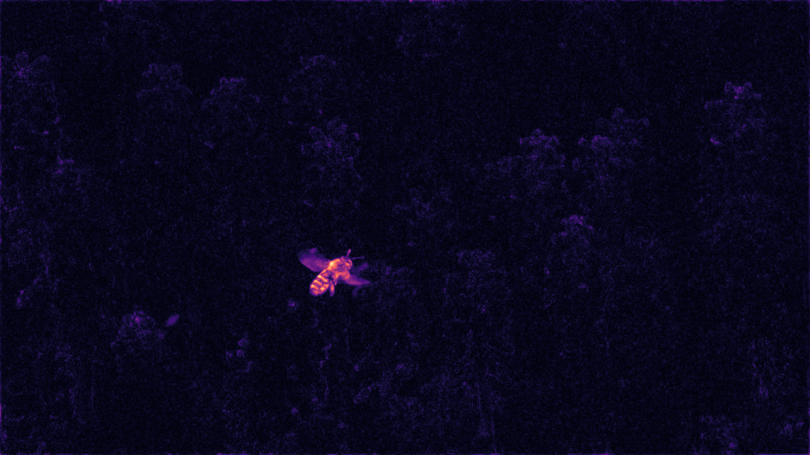 </br> FLIP=0.0534 |
| Decoded</br> Image |  |  | -->
<table>
    <tr>
        <td style="text-align: center"></td>
        <td style="text-align: center">Proposed (learned scales), BPP=0.060</td>
        <td style="text-align: center">Trained Dense, BPP=0.064</td>
    </tr>
    <tr>
        <td style="text-align: center">FLIP</td>
        <td style="text-align: center"><br />FLIP=0.0532</td>
        <td style="text-align: center"><br />FLIP=0.0534</td>
    </tr>
    <tr>
        <td style="text-align: center">Decoded<br />Image</td>
        <td style="text-align: center"></td>
        <td style="text-align: center"></td>
    </tr>
</table>
<br />

### Proposed (learned scales) vs. Trained Sparse
#### Beauty
<!-- |                    | Proposed (learned scales), BPP=0.060   | Trained Sparse, BPP=0.076 |
|:------------------:| :------------------------------------: | :--------------------------------: |
| FLIP               | 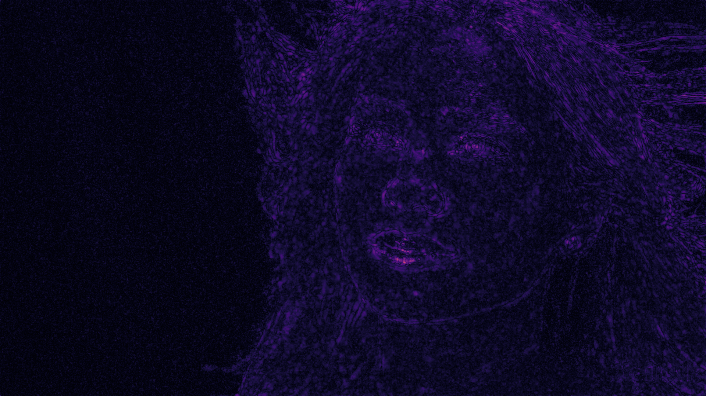 </br> FLIP=0.0702 | 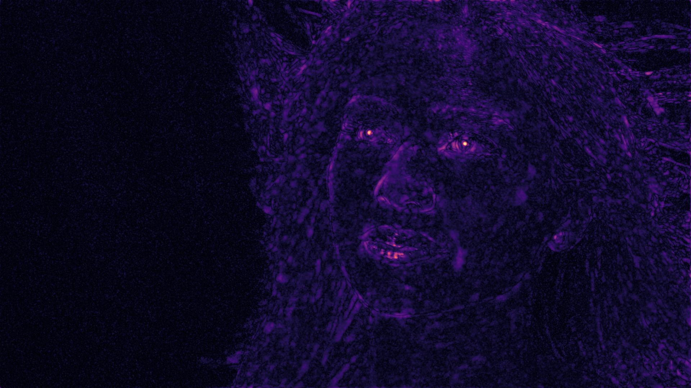 </br> FLIP=0.0768 |
| Decoded</br> Image |       |  | -->
<table>
    <tr>
        <td style="text-align: center"></td>
        <td style="text-align: center">Proposed (learned scales), BPP=0.060</td>
        <td style="text-align: center">Trained Sparse, BPP=0.076</td>
    </tr>
    <tr>
        <td style="text-align: center">FLIP</td>
        <td style="text-align: center"><br />FLIP=0.0702</td>
        <td style="text-align: center"><br />FLIP=0.0768</td>
    </tr>
    <tr>
        <td style="text-align: center">Decoded<br />Image</td>
        <td style="text-align: center"></td>
        <td style="text-align: center"></td>
    </tr>
</table>
<br />

#### YachtRide
<!-- |                    | Proposed (learned scales), BPP=0.060   | Trained Sparse, BPP=0.076 |
|:------------------:| :------------------------------------: | :--------------------------------: |
| FLIP               | 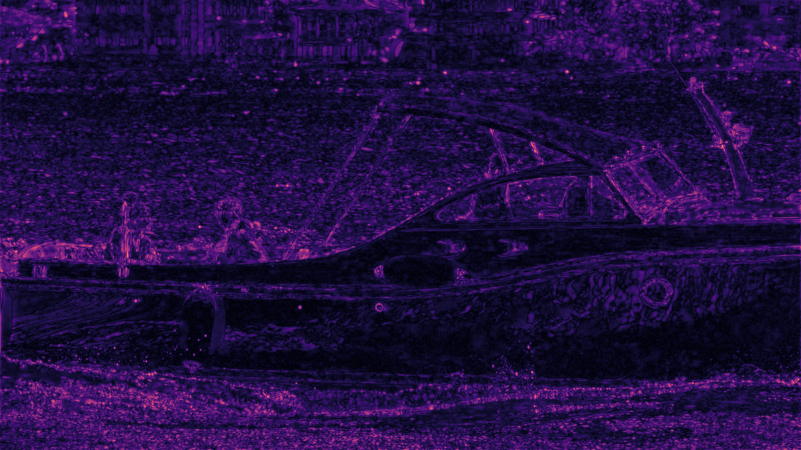 </br> FLIP=0.1258 | 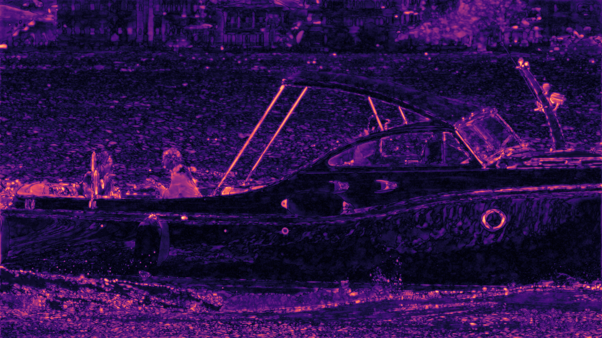 </br> FLIP=0.1499 |
| Decoded</br> Image |      |  | -->
<table>
    <tr>
        <td style="text-align: center"></td>
        <td style="text-align: center">Proposed (learned scales), BPP=0.060</td>
        <td style="text-align: center">Trained Sparse, BPP=0.076</td>
    </tr>
    <tr>
        <td style="text-align: center">FLIP</td>
        <td style="text-align: center"><br />FLIP=0.1258</td>
        <td style="text-align: center"><br />FLIP=0.1499</td>
    </tr>
    <tr>
        <td style="text-align: center">Decoded<br />Image</td>
        <td style="text-align: center"></td>
        <td style="text-align: center"></td>
    </tr>
</table>
<br />

### Proposed (learned scales) vs. Proposed (fixed scales)
#### Jockey
<!-- |                    | Proposed (learned scales), BPP=0.060   | Proposed (fixed scales), BPP=0.060 |
|:------------------:| :------------------------------------: | :--------------------------------: |
| FLIP               | 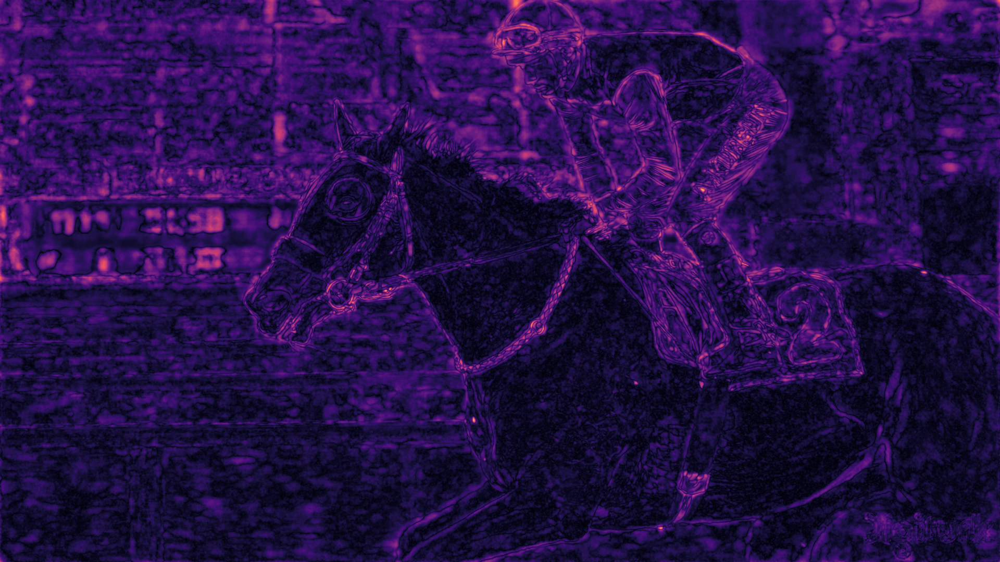 </br> FLIP=0.1401 |  </br> FLIP=0.1466 |
| Decoded</br> Image |       |    | -->
<table>
    <tr>
        <td style="text-align: center"></td>
        <td style="text-align: center">Proposed (learned scales), BPP=0.060</td>
        <td style="text-align: center">Proposed (fixed scales), BPP=0.060</td>
    </tr>
    <tr>
        <td style="text-align: center">FLIP</td>
        <td style="text-align: center"><br />FLIP=0.1401</td>
        <td style="text-align: center"><br />FLIP=0.1466</td>
    </tr>
    <tr>
        <td style="text-align: center">Decoded<br />Image</td>
        <td style="text-align: center"></td>
        <td style="text-align: center"></td>
    </tr>
</table>
<br />

#### ReadySteadyGo
<!-- |       | Proposed (learned scales), BPP=0.060   | Proposed (fixed scales), BPP=0.060 |
|:------------------:| :------------------------------------: | :--------------------------------: |
| FLIP               | 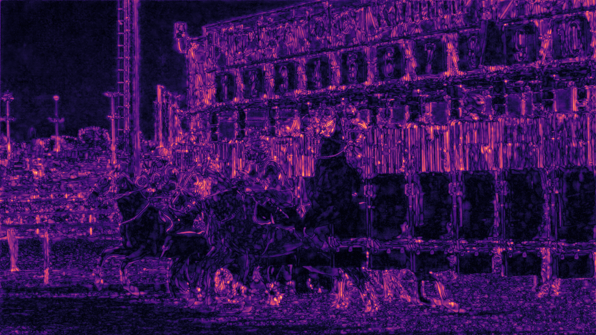 </br> FLIP=0.1761 | 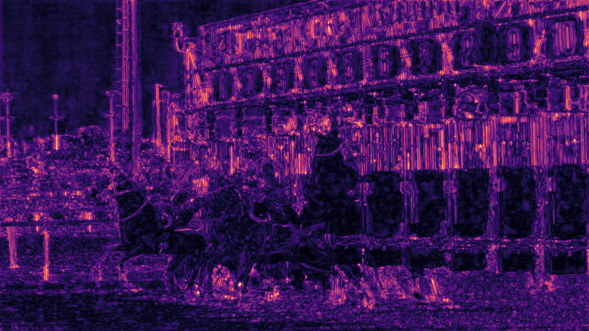 </br> FLIP=0.1932 |
| Decoded</br> Image |  |  | -->
<table>
    <tr>
        <td style="text-align: center"></td>
        <td style="text-align: center">Proposed (learned scales), BPP=0.060</td>
        <td style="text-align: center">Proposed (fixed scales), BPP=0.060</td>
    </tr>
    <tr>
        <td style="text-align: center">FLIP</td>
        <td style="text-align: center"><br />FLIP=0.1761</td>
        <td style="text-align: center"><br />FLIP=0.1932</td>
    </tr>
    <tr>
        <td style="text-align: center">Decoded<br />Image</td>
        <td style="text-align: center"></td>
        <td style="text-align: center"></td>
    </tr>
</table>
<br />
<br />

<!-- citation -->
## __Citation__
```
@inproceedings{choi2023inrslt,
    author = {Choi, Hee min and Kang, Hyoa and Oh, Dokwan},
    title = {Is Overfitting Necessary for Implicit Video Representation?},
    booktitle = {Proceedings of the 40th International Conference on Machine Learning},
    year = {2023}
}
```